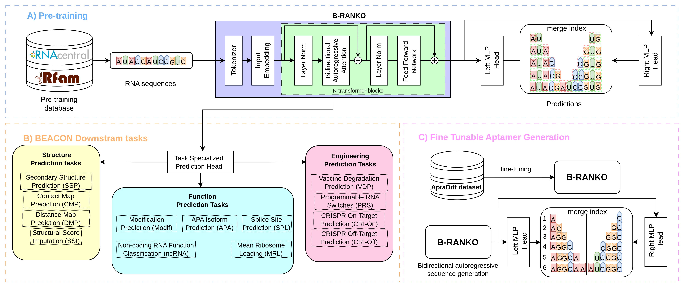
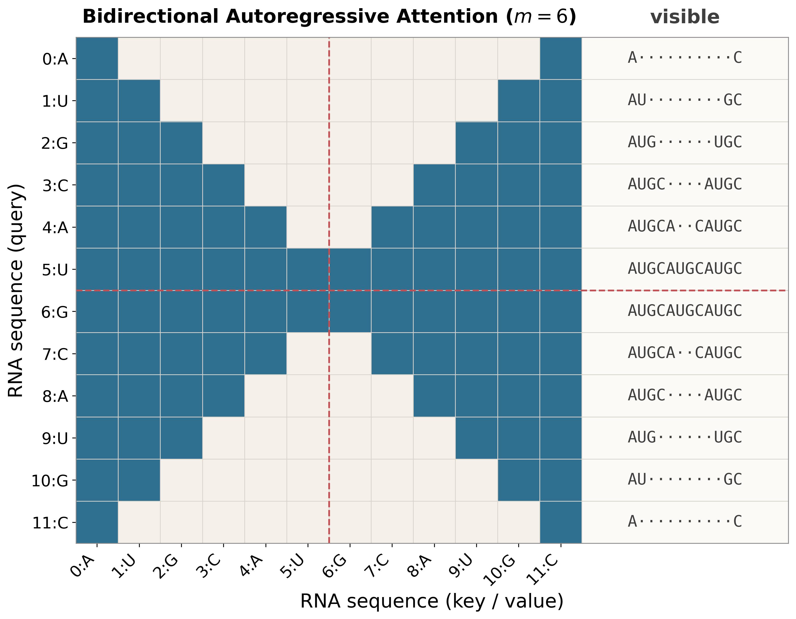
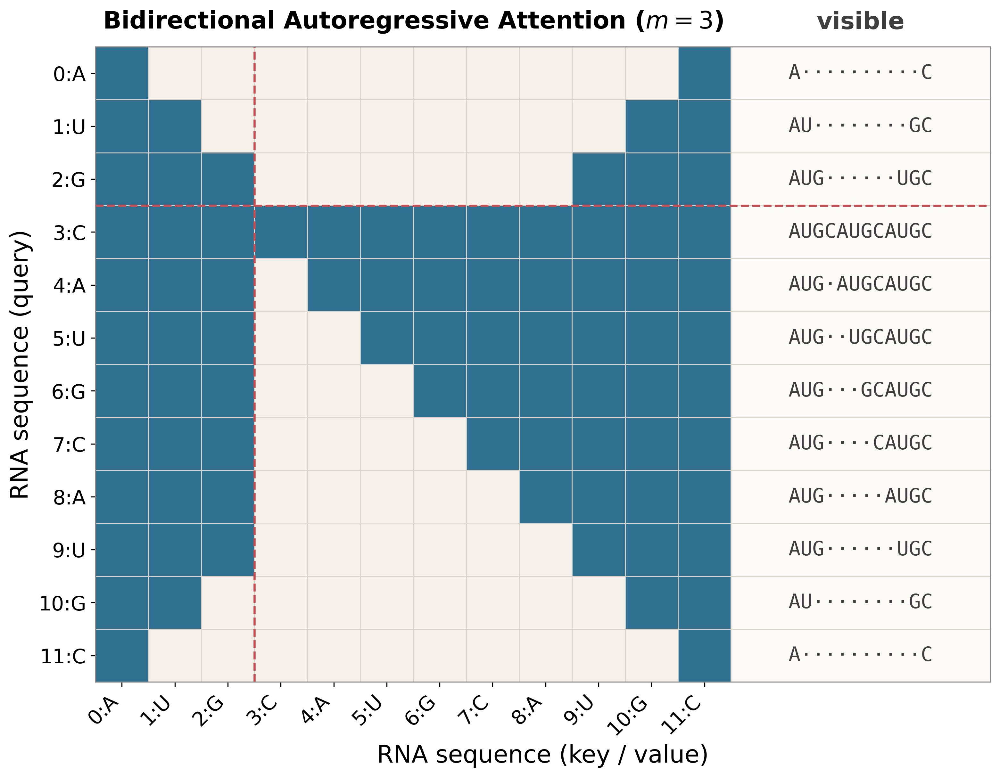

# B-RANKO

B-RANKO is a decoder-only RNA language model built around bidirectional autoregressive attention. Instead of generating only from left to right, it grows RNA sequences from both ends toward a predefined merge point. This keeps the training objective autoregressive while letting the shared transformer backbone integrate context from both directions.

## Model overview



B-RANKO combines autoregressive RNA generation with bidirectional contextual modeling inside a single decoder-only architecture. The model operates on nucleotide-level tokens with a shared transformer backbone, rotary positional embeddings, and two output heads:

- a left head that predicts the next token from the left side
- a right head that predicts the next token from the right side

During training, a merge index is sampled uniformly and splits each sequence into a left-owned region and a right-owned region. Both heads are trained through the same backbone, so the hidden states learned for generation can also be reused as contextual RNA representations.

## Bidirectional autoregressive attention

<p align="center">
  
  
</p>

For a sequence of length `T`, B-RANKO chooses a merge index `m` that determines where the left and right decoding fronts meet. The model keeps an autoregressive objective, but it does not decode strictly left-to-right. Instead, it grows the sequence from both ends:

- the left side expands inward from the `<SOS>` token
- the right side expands inward from the `<EOS>` token
- the two fronts meet at a merge index near the center

Positions `i < m` are supervised by the left head, and positions `i >= m` are supervised by the right head. The attention mask exposes only the prefix already generated from the left and the suffix already generated from the right at that inward generation step, so the model never sees future tokens from either frontier. This gives B-RANKO bidirectional context without turning the objective into masked-language modeling.

At inference time, fixed-length generation follows the same inward pattern. The sequence is initialized with `<SOS>` and `<EOS>`, and tokens are sampled from both sides toward the middle. If the two fronts meet at a single center position, the left and right logits are averaged before the final sample. For representation extraction, the same backbone can be run with full bidirectional self-attention to produce contextual per-nucleotide states and pooled sequence embeddings.

## Workflows

### Pre-training

Pre-training uses the same bidirectional autoregressive objective on large RNA corpora, including data from RNAcentral and Rfam. The shared backbone learns to predict the next token from the left frontier and the right frontier at the same time, which is what lets the final model support both generation and transferable internal representations.

### Aptamer fine-tuning

Fine-tuning keeps the same model and the same inward training objective, but initializes from the base B-RANKO model and continues training on task-specific FASTA data. The included example config targets IGFBP3 aptamer generation on AptaDiff Dataset A. 

### Representation learning

Representation learning uses the same trained model in encoding mode rather than generation mode. Complete RNA sequences are encoded with bidirectional attention, which produces contextual token-level hidden states. Sequence-level representations are then obtained with covariance pooling, which can then be used for downstream structure, function, and RNA engineering tasks.

## Repository layout

```text
.
├── README.md
├── assets
│   └── figures
├── branko
│   ├── __init__.py
│   ├── lightning.py
│   ├── masks.py
│   ├── utils.py
│   ├── data
│   │   ├── __init__.py
│   │   ├── data_preparation.sh
│   │   ├── dataset.py
│   │   ├── pretraining_dataset_conf.yaml
│   │   └── tokenizer.py
│   └── model
│       ├── __init__.py
│       ├── attention.py
│       ├── covariance_pooling.py
│       ├── model.py
│       ├── modules.py
│       └── rope.py
├── configs
│   ├── finetune
│   │   └── branko_aptamer_example.yaml
│   └── pretrain
│       └── branko_pretrain.yaml
├── data
│   └── aptadiff_datasetA
├── environment.yml
├── examples
│   └── quickstart.ipynb
├── install.sh
├── pyproject.toml
├── scripts
│   ├── build_length_distribution.py
│   ├── evaluate.py
│   ├── generate.py
│   └── train.py
└── weights
```

## Installation

Create the environment and install the package:

```bash
./install.sh
```

The install script currently does not download model files. If the released model files are already present in `weights/`, you can use them directly after installation.

## Generation

For command-line generation, sample fixed-length sequences from a model file:

```bash
python scripts/generate.py \
  --model weights/branko_mega_cpool128.ckpt \
  --output-dir runs/generation_demo \
  --num-sequences 100 \
  --sequence-length 40
```

`--model` also accepts raw Lightning training checkpoints. In that case, keep `config.yaml` next to the checkpoint or pass it explicitly with `--config`.

To build a sequence-length distribution file from FASTA or CSV data:

```bash
python scripts/build_length_distribution.py \
  --input-files data/train.fasta data/val.fasta \
  --output-file data/length_distribution.csv
```

## Evaluation

You can evaluate one or more generated FASTA files against a reference FASTA with:

```bash
python scripts/evaluate.py \
  --generated branko=runs/generation_demo/generated_sequences.fasta \
  --reference data/reference.fasta \
  --output-dir runs/generation_demo/evaluation
```

By default, evaluation includes length, GC content, average MFE per nucleotide, MMseqs2 novelty, and MMseqs2 diversity metrics.


## Fine-tuning

The same training entry point is used for both pre-training and fine-tuning. Fine-tuning differs only in that the config points to initialization weights through `init_model`.

```bash
python scripts/train.py --config configs/finetune/branko_aptamer_example.yaml
```

The included example mirrors the aptamer setting from the paper and initializes from the base B-RANKO model. `init_model` can point to either a bundled B-RANKO model file or a Lightning checkpoint. If the config does not include a `model` section, `init_model` must be a bundled model because the architecture config is read from that file.

Training writes regular Lightning files for resume support and one final bundled model, `branko_final.ckpt`, in the configured `output_dir`.

## Quickstart

For a quick introduction, start with [examples/quickstart.ipynb](examples/quickstart.ipynb).

The notebook is organized into three short parts:

1. setup and model loading
2. de novo RNA generation
3. representation extraction with covariance pooling

It uses the released `weights/branko_mega_cpool128.ckpt` bundle, so the sequence-level representation example runs with the covariance-pooling head enabled.
